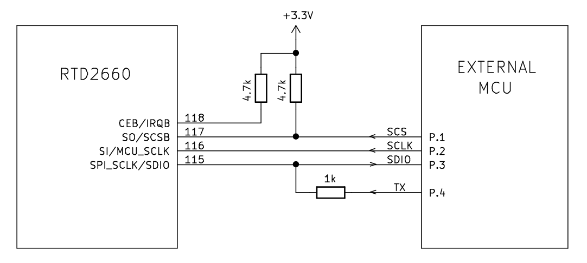

# RTD2660 LCD controller driver for using in AVR MCU #

This is an open-source library for dealing with RTD2660 or RTD2662 display and OSD controllers from your AVR project. It was designed to provide a high-level interface in order to simplify developers work and to give an opportunity to design and create low-cost devices with LCDs up to FullHD size.


## Hardware connections ##

RTD2660 or RTD2662 LCD controllers may be connected with an external MCU using the following schematics

<div align="center">  </div>


----

## Usage example ##

A sample project is included in this repository. It demonstrates several library's methods and the result, that could be achieved, when using this library.
The following hardware was used in this sample project:
* TM060RDH01 LCD panel;
* PCB800809.V6 board with RTD2660;
* [OM-128](https://github.com/specadmin/OM-128) development board with ATmega1284p.

<div align="center">  </div>


### Compile ###

```
git clone https://github.com/specadmin/RTD2660AVR
cd RTD2660AVR
git submodule update --init
cd sample
make
```

You may need to make some changes in [Makefile](sample/Makefile), corresponding to your hardware.


### Unpload the firmware

`make install`

This command uses `avrdude` for uploading the firmware. See Makefile for details.


----


## Several projects that use this library ##

[Lexus RX300 Display](https://github.com/users/specadmin/projects/2)

<div align="center">  </div>

<br> <br>

Contact me to add your project here

----


## Dependencies ##

* RTD2660 or RTD2662 IC
* [avr-misc library](https://github.com/specadmin/avr-misc)
* [avr-debug library](https://github.com/specadmin/avr-debug) (may be excluded)


## Requirements ##

* [AVR MCU](https://www.microchip.com/design-centers/8-bit/avr-mcus)
* [GNU AVR C compiller (avr-gcc)](https://gcc.gnu.org/wiki/avr-gcc)
* [AVR Libc library](https://nongnu.org/avr-libc)
* All libraries' and drivers' folders should be placed in the same directory.


## Adding to your project ##

```
git submodule add https://github.com/specadmin/RTD2660AVR lib/RTD2660AVR
```

## Isues and comments ##

Please report all bugs and comments at the [following page](https://github.com/specadmin/RTD2660AVR/issues).

----
This is not a final version of the library description. Follow the repository changes to keep in sync.

Feel free to contact me: `ton(__at__)specadmin.ru`
